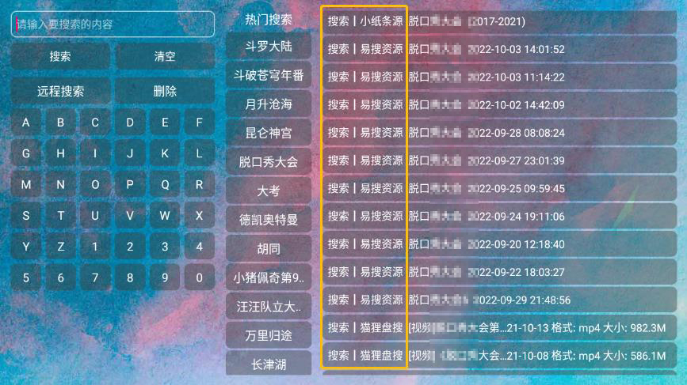
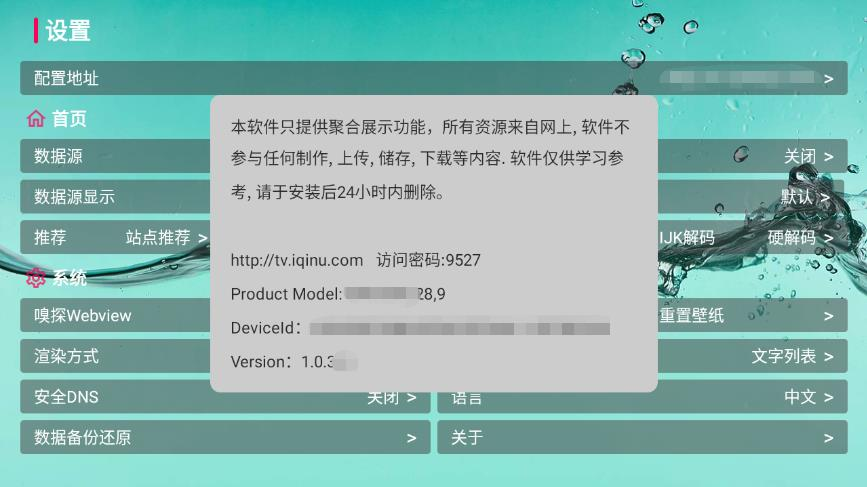

### 龙门影视盒子 
#### 自适应TV+平板+手机 点播+直播 双播盒子软件

龙门影视盒子是一款根据TVbox修改而来的盒子双播软件，经过无数次的更改适配了手机、平板、智能电视和TV盒子，并且支持安卓4.x，所以对很多旧的智能电视和盒子支持是相当友好的，也越来越好用，且对软件部分做出修改优化，内置超多优质资源，当然也包括了爱优腾。画质也非常的感人，并且软件无广告。

### 版本
- 1.龙门影视 - [LmBox_v1.0.3.apk](http://www.looo.top)

### 源
这款龙门影视最大的特点就是它的资源，绝对是目前最为丰富的一款。速度高清软件也在前面，其余应该都是搜刮的各路优质源，而且开箱即用不需要配置。

资源真的超级多，不是盖的。而且在首页点击更多即可设置，也非常方便。

### 内容
在导航条上增加了筛选功能，并在导航条上点击可呼出筛选，可按年份地区类型挑选节目，筛选栏跟新为透明框。

详情页可以“快速搜索”这个源没有的可以快速找到可以使用的，播放解析源也又多种选择。更有1080和蓝光等超清画质片源。

画质清晰细腻，速度也是蛮快的，增加倒序、收藏、解析、倍速、跳过片头片尾、重置等这些小更新，细节做到细致入微。

喜欢用MxPlayer、Reex和Kodi外置播放器的朋友，也可以在设置中选择外置播放器来播放。

直播源也非常好，可以看全国各地的卫视、轮播节目、儿童频道。港澳台及视界频道都非常流畅。

不仅如此，软件还继成了优秀博主的阿里云盘、OneDrive、蓝奏云盘等各种网盘Alist资源集合。

上面这些几乎能让你免费搜到所有你想看的片源了。如果这还不够的话，软件还特地加入了小纸条、易搜、狸猫盘搜、T4聚合等网盘搜索引擎。

### 下载
总体来说，这是，目前为止见过最强大的自适应TV+平板+手机、点播+直播、双播盒子软件。赶紧下载试试吧。

- 1.蓝奏云 - [https://mop.lanzout.com/b0fg0vmid](https://mop.lanzout.com/b0fg0vmid) 密 9527